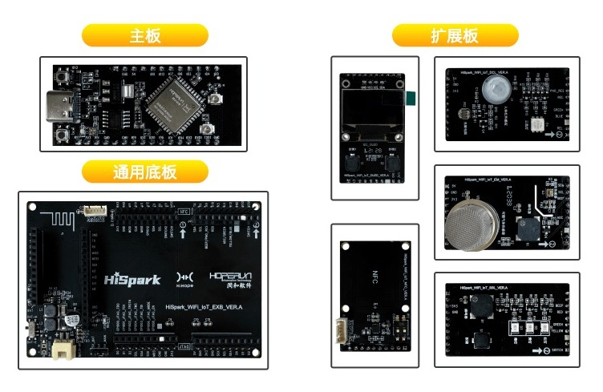
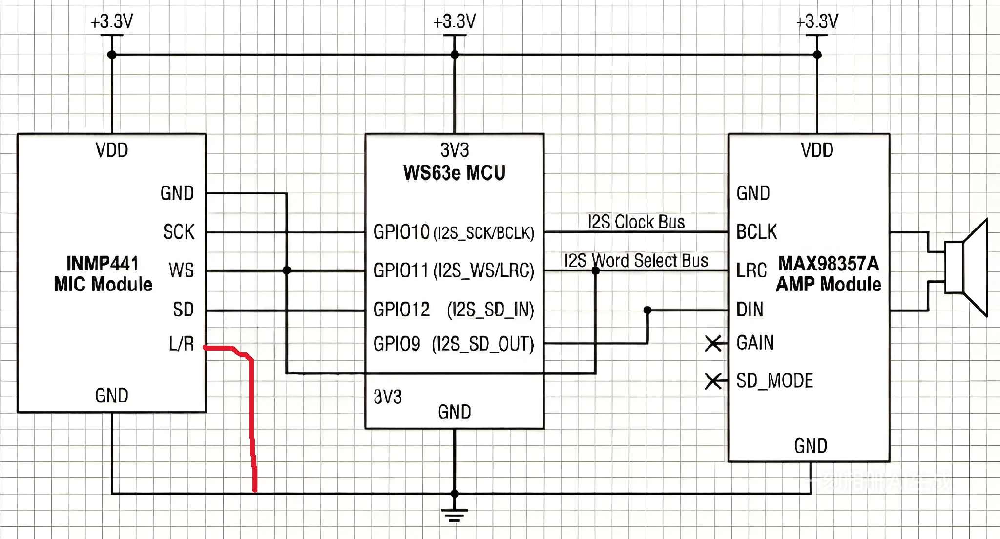

# fbb_ws63 开发说明文档

## 1. 编译fbb_ws63环境搭建文档说明

### 系统要求
- Linux操作系统（推荐Ubuntu）
- Python 3.x
- Git（用于下载代码）

### 硬件要求

#### 所需硬件
- WS63开发板（如HiHope_NearLink_DK_WS63E_V03或BearPi-Pico_H3863）
- INMP441麦克风模块
- MAX98357A扬声器模块

#### 硬件图片


环境搭建步骤

1. **下载代码**
   
   ```bash
   git clone git@github.com:604229681/ws63.git
   cd ws63
   
2. **编译环境检查**
   - 如果首次编译，请先执行如下命令，编译依赖的环境
    ```bash
     sudo apt update
   
     sudo apt install python3-kconfiglib -y
   
     sudo apt install cmake make gcc-arm-none-eabi gcc g++ libncurses-dev python3-kconfiglib -y
    
     sudo apt install python3-pycparser -y
    ```

3. **编译命令**
   
   - 进入src目录：
   ```bash
     cd src
   ```
   - 全量编译：
   ```bash
     python3 build.py -c ws63-liteos-app
   ```
   - 增量编译：
   ```bash
     python3 build.py ws63-liteos-app
   ```
   - 带图形配置界面编译：
   ```bash
     python3 build.py -c ws63-liteos-app menuconfig
   ```
   
4. **编译输出**
   - 成功编译后，输出文件位于 `src/output/ws63/fwpkg/ws63-liteos-app/`
   - 主固件文件：`ws63-liteos-app-all.fwpkg` 该估计可以烧入到设备上

5. **可以参考【WSL子系统编译及烧录】**

	```bash
	https://gitee.com/HiSpark/fbb_ws63/blob/master/tools/WSL%E5%AD%90%E7%B3%BB%E7%BB%9F%E7%BC%96%E8%AF%91%E5%8F%8A%E7%83%A7%E5%BD%95.md
	```

## 2. INMP441文件代码关键知识和流程

### 概述
INMP441示例代码实现了基于WS63芯片的音频处理系统，包括：
- INMP441麦克风音频采集
- MAX98357A功放音频播放
- WebSocket网络音频传输
- WiFi热点连接

### 硬件接线图


### 关键组件

#### I2S音频接口
- **配置参数**：
  - 采样率：32kHz
  - 声道：双声道（立体声）
  - 数据宽度：16位
  - 模式：主模式
- **引脚复用**：
  - GPIO9: I2S_DO
  - GPIO10: I2S_SCLK
  - GPIO11: I2S_WS
  - GPIO12: I2S_DI

#### 音频处理参数
- **缓冲区大小**：2048帧（8192字节）
- **帧持续时间**：64ms
- **音量控制**：0-100范围，映射到0.0-6.0倍增益
- **DC偏移校正**：使用指数移动平均滤波

#### WebSocket通信
- **服务器地址**：192.168.43.5:8000（需根据实际网络配置修改）
- **数据格式**：二进制音频数据
- **协议**：WebSocket RFC 6455
- **功能**：
  - 发送麦克风音频数据到服务器
  - 接收服务器音频数据进行播放
  - 自动重连机制

#### WiFi连接
- **热点名称**：testap（需修改为实际WiFi名称）
- **密码**：12345678（需修改为实际密码）
- **连接流程**：
  - 扫描目标AP
  - 建立连接
  - DHCP获取IP地址

### 代码流程

#### 初始化阶段
1. **I2S初始化**：
   - 配置引脚复用
   - 设置I2S参数（采样率、声道等）
   - 启用DMA传输

2. **WiFi连接**：
   - 扫描并连接到配置的WiFi热点
   - 等待DHCP获取IP地址

3. **WebSocket初始化**：
   - 建立TCP连接到服务器
   - 执行WebSocket握手
   - 启动接收任务线程

#### 音频处理循环
1. **异步发送**：
   - 通过DMA发送处理后的音频数据到扬声器

2. **同步接收**：
   - 通过DMA从麦克风接收原始音频数据

3. **音频处理**：
   - 提取左声道数据
   - 应用DC偏移校正
   - 应用音量增益
   - 转换为立体声格式

4. **网络传输**：
   - 发送处理后的麦克风数据到WebSocket服务器
   - 从环形缓冲区读取网络音频数据用于播放

5. **播放控制**：
   - 实现半双工语音控制
   - 添加播放冷却期避免回声

#### 错误处理
- WebSocket连接失败时自动重连
- DMA传输错误检测
- 网络缓冲区溢出保护

### 关键函数
- `app_i2s_init()`: I2S接口初始化
- `process_audio_buffer()`: 音频数据处理
- `on_ws_audio_received()`: WebSocket数据接收回调
- `wifi_connect_to_hotspot()`: WiFi连接
- `audio_websocket_init()`: WebSocket连接初始化

## 3. 硬件电路接线原理

### INMP441麦克风模块
- INMP441是一款高性能、低功耗的数字麦克风
- 支持PDM（脉冲密度调制）输出
- 工作电压：1.5V-3.3V

### MAX98357A功放模块
- MAX98357A是数字音频功放芯片
- 支持I2S输入
- 输出功率：3.2W（8Ω负载）

### 连接电路图
请参考项目中的 `src\application\samples\peripheral\INMP441\INMP441连接电路图.jpeg` 文件，该图详细展示了：
- WS63芯片与INMP441麦克风的连接方式
- WS63芯片与MAX98357A功放的连接方式
- 电源和信号线的布线原理
- 必要的滤波电容和上拉电阻

**注意**：实际接线时请严格按照电路图进行，避免电源反接或信号线短路。

## 4. 编译完成后，烧写流程文档

### 硬件准备
1. **开发板连接**：
   - 使用Type-C数据线将开发板连接到PC
   - 确保开发板上电（通常通过Type-C供电）

2. **驱动安装**：
   - 下载并安装CH341SER驱动（https://www.wch.cn/downloads/CH341SER_EXE.html）
   - 安装前确保开发板已连接PC

### 烧写工具准备
1. **下载BurnTool**：
   - 从HiSpark仓库下载：https://gitee.com/hihope_iot/near-link/tree/master/tools

2. **工具配置**：
   - 解压BurnTool压缩包
   - 打开BurnTool工具
   - 在Option选项中选择目标芯片：WS63

### 烧写步骤
1. **选择串口**：
   - 在BurnTool中选择正确的COM端口
   - 端口可在设备管理器中查看（Windows）或使用`ls /dev/tty*`查看（Linux）

2. **选择烧写文件**：
   - 选择编译生成的固件文件：`ws63-liteos-app-all.fwpkg`
   - 文件路径：`fbb_ws63/src/output/ws63/fwpkg/ws63-liteos-app/`

3. **配置烧写选项**：
   - 勾选"Auto Burn"（自动烧写）
   - 勾选"Auto disconnect"（自动断开）

4. **开始烧写**：
   - 点击"connect"连接开发板
   - 连接成功后，按开发板上的RST复位按键开始烧写
   - 等待烧写完成（进度条显示100%）

5. **验证烧写**：
   - 烧写完成后，打开串口工具（如sscom、xshell）
   - 设置波特率：115200
   - 复位开发板，查看串口输出
   - 成功时会显示"flashboot version"等信息

6. **可以参考【WSL子系统编译及烧录】**

	```bash
	https://gitee.com/HiSpark/fbb_ws63/blob/master/tools/WSL%E5%AD%90%E7%B3%BB%E7%BB%9F%E7%BC%96%E8%AF%91%E5%8F%8A%E7%83%A7%E5%BD%95.md
	```

### 注意事项
- 烧写过程中请勿断开电源或数据线
- 如果烧写失败，请检查串口选择和固件文件路径
- 不同开发板的复位按键位置可能不同，请参考具体开发板手册
- Linux环境下可能需要配置串口权限：`sudo chmod 666 /dev/ttyUSB*`

### 常见问题
- **无法识别串口**：检查驱动安装和USB线连接
- **烧写失败**：确认固件文件完整，尝试重新编译
- **无串口输出**：检查波特率设置和开发板状态